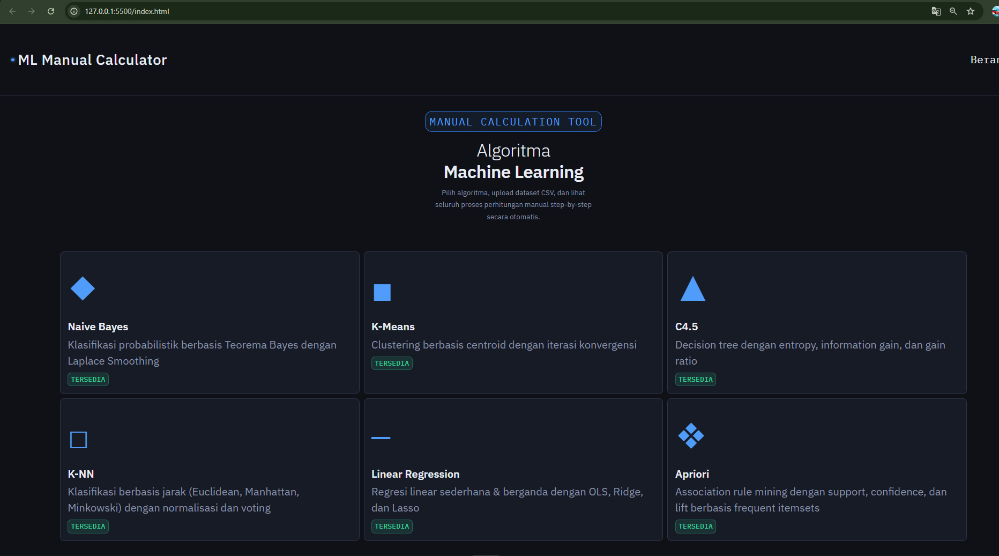
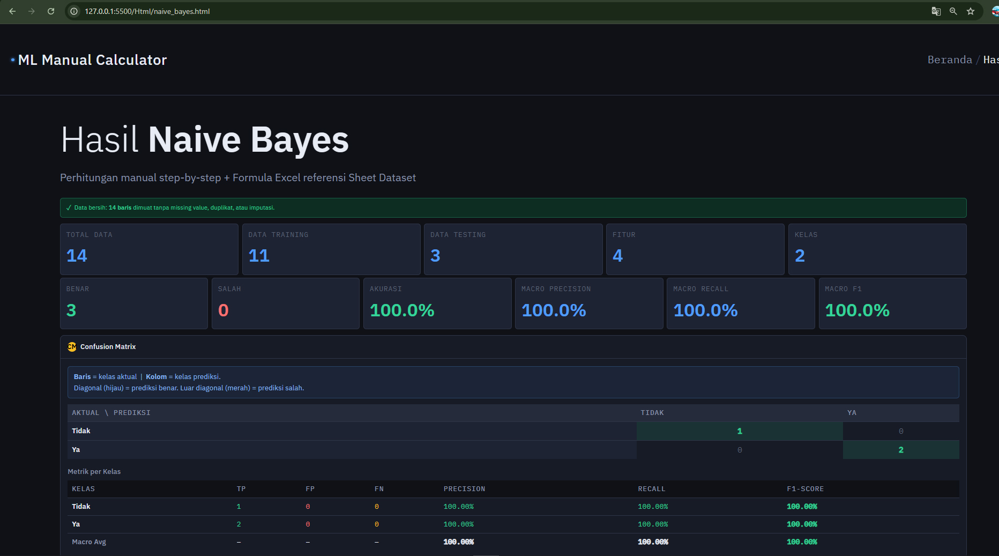
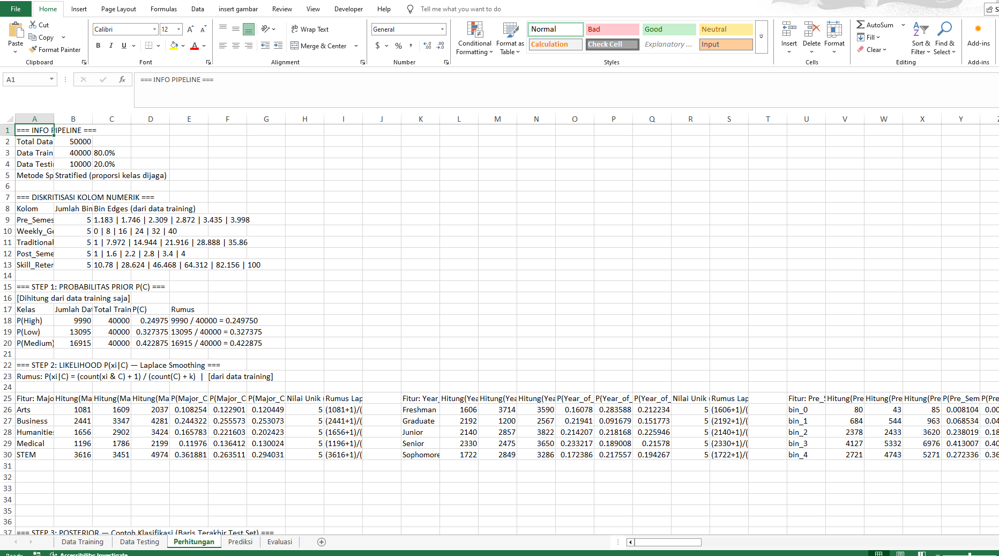
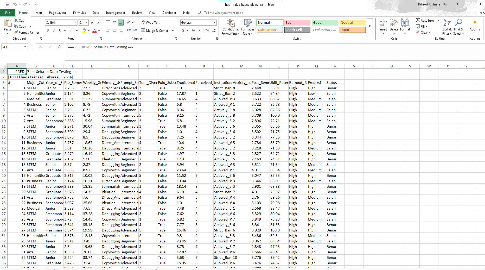

# ML Manual Calculator

**ML Manual Calculator** adalah aplikasi web interaktif berbasis browser untuk menjalankan algoritma Machine Learning secara **step-by-step manual** — lengkap dengan perhitungan detail, formula Excel yang bisa diunduh, serta visualisasi hasil.

Cocok untuk mahasiswa, pengajar, dan siapa pun yang ingin memahami cara kerja algoritma ML dari dalam, bukan hanya dari outputnya.

---

## Tampilan Aplikasi

### Beranda



Pilih salah satu dari enam algoritma yang tersedia. Setiap kartu menampilkan nama algoritma, deskripsi singkat, dan status ketersediaan.

---

### Upload Dataset


Setiap halaman algoritma memiliki zona upload CSV dengan:
- **Drag & drop** atau klik untuk memilih file
- **Dataset contoh bawaan** untuk langsung mencoba tanpa file sendiri
- Preview tabel otomatis setelah file dimuat
- Deteksi dan pembersihan missing value secara otomatis

---

### Hasil Proses



Setelah diproses, hasil ditampilkan secara lengkap:
- Metrik evaluasi (akurasi, F1, R², dan lain-lain)
- Perhitungan manual step-by-step
- Visualisasi (scatter plot, PCA chart, confusion matrix, dan lain-lain)
- Tombol download Excel (plain text & formula)

---

## Export Excel

Setiap algoritma menghasilkan file Excel multi-sheet. Tersedia dua mode:

- **Plain Text** — semua nilai sudah dihitung, tinggal baca
- **Formula** — semua sel berisi formula Excel aktif yang bisa diverifikasi dan dimodifikasi

### Sheet Dataset


Berisi data mentah yang digunakan, diberi label **TRAIN** atau **TEST** per baris, serta informasi metode split.

### Sheet Perhitungan



Langkah-langkah kalkulasi koefisien, entropy, jarak, atau iterasi centroid — tergantung algoritma. Versi formula merujuk antar sel secara berantai.

### Sheet Prediksi



Tabel seluruh data dengan kolom nilai aktual, nilai prediksi (ŷ), residual, dan status benar/salah.

### Sheet Evaluasi


Metrik evaluasi lengkap (R², MSE, RMSE, MAE, Precision, Recall, F1, Confusion Matrix) untuk training set dan test set secara berdampingan.

---

## Algoritma yang Tersedia

### 1. Naive Bayes

Klasifikasi probabilistik berbasis Teorema Bayes dengan **Laplace Smoothing**.

**Fitur:**
- Split train/test stratified (proporsi kelas terjaga), default 80:20
- Diskritisasi otomatis kolom numerik kontinu ke bin (equal-width, fit dari training set saja)
- Label Encoding: Boolean (`True/False → 1/0`), Label Encoding alfabetis untuk kategoris
- Perhitungan Prior `P(C)`, Likelihood `P(xi|C)`, dan Posterior `P(C|X)` step-by-step
- Confusion Matrix + Precision/Recall/F1 per kelas + Macro Average
- Export Excel 5 sheet: Data Training, Data Testing, Perhitungan, Prediksi, Evaluasi

---

### 2. K-Means Clustering

Clustering berbasis centroid dengan iterasi hingga konvergen.

**Fitur:**
- Normalisasi Min-Max otomatis sebelum komputasi
- Pilihan inisialisasi centroid: K Data Pertama, Random, atau Manual
- Metrik jarak: Euclidean atau Manhattan
- Visualisasi PCA 2D (proyeksi ke 2 komponen utama via power iteration)
- Perhitungan jarak per iterasi, update centroid, dan konvergensi ditampilkan lengkap
- Evaluasi: SSE/Inertia, Silhouette Score, Davies-Bouldin Index
- Export Excel 4 sheet: Dataset, Perhitungan (semua iterasi), Hasil Clustering, Evaluasi Metrik

---

### 3. C4.5 Decision Tree

Pohon keputusan dengan **Entropy**, **Information Gain**, dan **Gain Ratio**.

**Fitur:**
- Mendukung atribut numerik (binary split dengan midpoint atau mean) dan kategorikal
- Konfigurasi: max depth, min samples per node, threshold numerik
- Gain Ratio pre-filter sesuai Quinlan 1993 (hanya atribut dengan gain ≥ rata-rata yang dievaluasi)
- Komputasi berjalan di **Web Worker** — UI tetap responsif untuk dataset besar
- Pilihan split evaluasi: tanpa split (full training) atau Holdout (train/test stratified)
- Step-by-step accordion: entropy parent, tabel gain semua atribut, detail formula per atribut terpilih
- Pohon keputusan ditampilkan dalam format teks visual bercabang
- Panel prediksi interaktif: masukkan nilai fitur, dapatkan prediksi beserta jalur pohon
- Export Excel 4 sheet: Dataset, Perhitungan (entropy & gain per node), Prediksi, IF-THEN Rules + Evaluasi

---

### 4. K-Nearest Neighbors (K-NN)

Klasifikasi berbasis jarak ke K tetangga terdekat.

**Fitur:**
- Metrik jarak: Euclidean, Manhattan, Minkowski (p dapat dikonfigurasi)
- Voting: Uniform atau Distance-Weighted (bobot = 1/jarak)
- Normalisasi: tanpa, Min-Max, atau Z-Score
- Mendukung fitur kategoris via Label Encoding (Boolean → 1/0, teks → angka alfabetis)
- Komputasi di **Web Worker** — progres ditampilkan real-time
- Evaluasi Training dan Test set berdampingan, dengan deteksi potensi overfitting
- Export Excel 7 sheet dengan chain formula: Dataset → Stats → Norm → Jarak → Prediksi Test → Prediksi Train → Evaluasi

---

### 5. Linear Regression

Regresi linear sederhana (1 fitur) dan berganda (≥2 fitur).

**Fitur:**
- Dua mode input: upload CSV atau input manual lewat tabel di browser
- Regularisasi: OLS (tanpa), Ridge (L2), atau Lasso (L1, diselesaikan via coordinate descent)
- Dua metode split: Random (LCG deterministik, seed dapat diatur) atau Linear (systematic sampling)
- Scatter plot SVG inline (sederhana: garis regresi; berganda: actual vs predicted)
- Tabel kalkulasi dengan pagination (50 baris per halaman) untuk dataset besar
- Formula Excel lengkap per langkah yang bisa diklik dan disalin satu per satu
- Evaluasi R², MSE, RMSE, MAE untuk training dan test set
- Komputasi di **Web Worker** dengan progress bar
- Export Excel 5 sheet: Dataset, Dataset Normalisasi, Perhitungan, Prediksi, Evaluasi Metrik

---

### 6. Apriori (Association Rule Mining)

Frequent itemset mining dan association rule dengan **Support**, **Confidence**, dan **Lift**.

**Fitur:**
- Input format CSV transaksional (satu baris = satu transaksi, satu kolom = satu item) atau dataset contoh bawaan (Supermarket, Toko Kelontong)
- Konfigurasi: Min Support (slider 1%–100%), Min Confidence, dan Max panjang itemset (K=2 hingga 5)
- Tampilan step-by-step per iterasi: C1→L1, C2→L2, dan seterusnya, dengan pruning candidates yang tidak memenuhi threshold
- Ringkasan frequent itemsets dikelompokkan per K
- Association rules diurutkan berdasarkan Lift (tertinggi lebih dulu)
- Interpretasi otomatis: Positif (lift > 1), Negatif (lift < 1), Independen (lift = 1)
- Formula Excel untuk setiap langkah (COUNTIF, SUMPRODUCT)
- Export Excel 5 sheet: Dataset, Perhitungan (semua iterasi), Frequent Itemsets, Association Rules, Evaluasi Metrik

---

## Struktur Proyek

```
ML-Manual-Calculator/
├── index.html                    # Beranda — pilih algoritma
├── Html/
│   ├── naive_bayes.html
│   ├── k_means.html
│   ├── c45.html
│   ├── knn.html
│   ├── linear_regression.html
│   └── apriori.html
├── css/
│   ├── style.css                 # Stylesheet utama (dark theme)
│   ├── c45.css
│   ├── apriori.css
│   └── lr.css
├── js/
│   ├── Shared/
│   │   └── lcg.js                # LCG random number generator
│   ├── Naive_Bayes/
│   │   ├── nb_utils.js
│   │   ├── nb_io.js
│   │   ├── nb_col_selector.js
│   │   ├── nb_core.js
│   │   ├── nb_render.js
│   │   └── nb_export.js
│   ├── K_Means/
│   │   ├── km_utils.js
│   │   ├── km_io.js
│   │   ├── km_core.js
│   │   ├── km_render.js
│   │   └── km_export.js
│   ├── C45/
│   │   ├── c45_utils.js
│   │   ├── c45_io.js
│   │   ├── c45_core.js
│   │   ├── c45_worker.js         # Web Worker
│   │   ├── c45_render.js
│   │   └── c45_export.js
│   ├── KNN/
│   │   ├── knn_utils.js
│   │   ├── knn_io.js
│   │   ├── knn_core.js
│   │   ├── knn_worker.js         # Web Worker
│   │   ├── knn_render.js
│   │   └── knn_export.js
│   ├── LinearRegression/
│   │   ├── lr_utils.js
│   │   ├── lr_io.js
│   │   ├── lr_core.js
│   │   ├── lr_worker.js          # Web Worker
│   │   ├── lr_render.js
│   │   ├── lr_export.js
│   │   └── lr_main.js
│   └── Apriori/
│       ├── apriori_utils.js
│       ├── apriori_io.js
│       ├── apriori_core.js
│       ├── apriori_render.js
│       └── apriori_export.js
├── Assets/
│   └── Image/
│       └── Logo.ico
└── images/                       # Screenshot untuk README
    ├── Screenshot.jpg
    ├── upload.jpg
    ├── Result.jpg
    ├── Sheet1.jpg
    ├── Perhitungan.jpg
    ├── Prediksi.jpg
    └── Evluasi.jpg
```

---

## Format Dataset CSV

### Klasifikasi (Naive Bayes, K-NN, C4.5)

```
sepal_length,sepal_width,petal_length,petal_width,species
5.1,3.5,1.4,0.2,Iris-setosa
4.9,3.0,1.4,0.2,Iris-setosa
...
```

- Baris pertama = header kolom
- Kolom numerik dan kategoris keduanya didukung
- Kolom target (kelas) dipilih lewat UI (default: kolom terakhir)

### Clustering (K-Means)

```
ID,Usia,Pendapatan_Juta,Skor_Belanja
1,25,4.5,72
2,31,7.2,55
...
```

- Semua kolom fitur harus numerik
- Kolom ID/nama dapat dihapus centangnya di UI

### Regresi (Linear Regression)

```
Luas_m2,Kamar,Jarak_Pusat_km,Harga_Juta
45,2,12,320
60,3,8,450
...
```

- Semua kolom harus numerik
- Kolom target (Y) dipilih lewat dropdown

### Association Rules (Apriori)

```
TID,Item1,Item2,Item3
T001,Roti,Susu,Mentega
T002,Roti,Susu,
T003,Susu,Popok,Bir,Telur
...
```

- Kolom pertama bisa berisi TID/No/ID (opsional, terdeteksi otomatis)
- Setiap kolom berikutnya adalah satu item per kolom
- Sel kosong diabaikan

---

## Cara Menjalankan

Aplikasi ini adalah **pure front-end** — tidak memerlukan server, database, atau instalasi backend apa pun.

1. Clone atau unduh repositori ini
2. Buka `index.html` di browser modern (Chrome, Firefox, Edge, Safari)
3. Pilih algoritma dan mulai eksplorasi

> Untuk algoritma dengan Web Worker (C4.5, K-NN, Linear Regression), buka via HTTP server lokal (bukan file:// langsung) agar Worker dapat dimuat dengan benar. Gunakan ekstensi Live Server di VS Code, atau jalankan `python -m http.server` di direktori proyek.

---

## Teknologi

| Komponen | Teknologi |
|---|---|
| UI & Logika | Vanilla JavaScript (ES6+) |
| Stylesheet | CSS Custom Properties (dark theme) |
| Komputasi berat | Web Workers |
| Export Excel | [SheetJS (xlsx)](https://sheetjs.com/) via CDN |
| Font | IBM Plex Sans + IBM Plex Mono (Google Fonts) |
| Visualisasi | SVG inline (scatter plot, PCA chart, decision tree) |

Tidak ada framework JavaScript. Tidak ada build tool. Tidak ada dependensi npm.

---

## Fitur Teknis Utama

- **Web Workers** — komputasi K-NN, C4.5, dan Linear Regression berjalan di background thread sehingga UI tidak pernah freeze
- **LCG (Linear Congruential Generator)** — shuffle deterministik dengan seed yang dapat diatur, menghasilkan split yang reproducible (`X_{n+1} = (1664525 × X_n + 1013904223) mod 2³²`)
- **Stratified Split** — proporsi kelas dijaga di training dan test set untuk semua algoritma klasifikasi
- **Chain Formula Excel** — sheet-sheet dalam file Excel saling merujuk: Dataset → Stats → Normalisasi → Jarak → Prediksi → Evaluasi, sehingga mengubah satu nilai di sheet Dataset akan memperbarui seluruh chain secara otomatis
- **Label Encoding** — fitur Boolean (`True/False → 1/0`) dan kategoris (teks → angka alfabetis) diproses otomatis sebelum normalisasi dan kalkulasi jarak
- **Data Leakage Prevention** — statistik normalisasi (min, max, mean, std) selalu dihitung dari training set saja, lalu diterapkan ke test set

---

## Lisensi

Proyek ini bebas digunakan untuk keperluan pendidikan dan penelitian.
